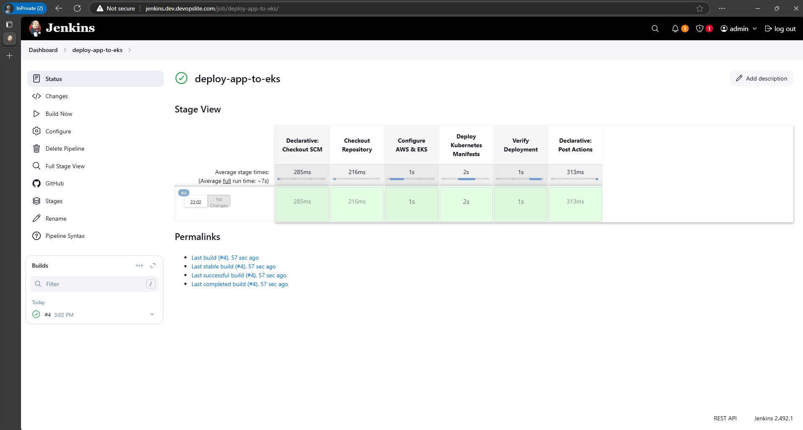

# DevOps deployment example with Terraform + EKS + Jenkins stack

### Table of contents

- [1. System architecture](#1-system-architecture)
- [2. How to apply terraform?](#2-how-to-apply-terraform)
    - [2.1 Create S3 bucket for remote backend](#21-create-s3-bucket-for-remote-backend)
    - [2.2 Apply main terraform](#22-apply-main-terraform)
- [3. Using Jenkins to deploy app to EKS](#3-using-jenkins-to-deploy-app-to-eks)
- [4. Load testing with hey and HPA](#4-load-testing-with-hey-and-hpa)
- [5. Setting up API Gateway with Lambda Authorizer](#5-setting-up-api-gateway-with-lambda-authorizer)
- [6. Software version](#6-software-version)

> **Note 1: All secrets used in this example are temporary, after finishing the lab I deleted all of them so they will no longer have any effect. I did not cover them but left them as is, to help you visualize how to use them**.

> **Note 2: In the limited time of the example, secrets are declared directly in the ingress and lambda functions. In reality, we will use a service like Secrets Manager combined with External Secret on EKS to manage secrets without revealing them. You can refer to my other demo for more information**. [https://github.com/dungpham91/devops.demo.argocd/blob/main/apps/backend/templates/externalsecret.yaml](https://github.com/dungpham91/devops.demo.argocd/blob/main/apps/backend/templates/externalsecret.yaml).


## 1. System architecture


## 2. How to apply terraform?

You can leave out `-auto-approve` from the `terraform apply` command if you want to double check before creating the resources.

### 2.1 Create S3 bucket for remote backend

Follow the steps below to apply terraform, which will create an EKS cluster and resources on AWS.

- Open the [terraform/backend/main.tf](./terraform/backend/main.tf) file and comment lines `9-15`. Move into the [terraform/backend](./terraform/backend/) directory and run the command:

```sh
terraform init
terraform apply -auto-approve
```


- After successfully creating, uncomment lines 9-15 above, then run the following command to migrate the state of the backend module to S3.

```sh
terraform init -migrate-state
```

### 2.2 Apply main terraform

- Go to the [terraform/env/dev](./terraform/env/dev/) directory and run the command:

```sh
terraform init
terraform apply -auto-approve
```


## 3. Using Jenkins to deploy app to EKS

In this example, I used a Jenkins server to deploy the `httpbin` application onto the EKS cluster.

You can install the Jenkins server with Docker Compose in the [jenkins-compose/docker-compose.yaml](./jenkins-compose/docker-compose.yaml) folder.

As for the setup steps inside Jenkins Admin, I will not present here. Because we are not focusing on how to use Jenkins.

Jenkins jobs are declared using [Jenkinsfile](./Jenkinsfile) in the repository.




- Jenkins job has integrated sending notification to slack channel after deployment is complete.


After deploying the `httpbin` app in the [application](./application/) folder to EKS, I will create a DNS record pointing to the public address of the Ingress Controller. Here I am using Nginx Ingress Controller.


## 4. Load testing with hey and HPA

The EKS cluster I created with Node Group allows auto scaling `from 3 to 8 nodes` [terraform/env/dev/variables.tf#L56](./terraform/env/dev/variables.tf#L56).

Combined with HPA settings to automatically scale the number of pods.

To test whether the scaling is working, I set the HPA's `averageUtilization` to `1%`.

At the same time, I used `hey` to send `10k requests` to the application's url, to see how it automatically scales.

This is when the app is in normal mode.


And this is when I use `hey` to send 10k requests.


The HPA event reported an increase.


Check the number of pods also increased to the `max of 5` that I set in [deployment.yaml](./application/deployment.yaml).


If you notice, there is 1 AGE pod of `112s` and the remaining 4 pods are almost the same, `36s and 21s`. Those are the pods created when testing with `hey`.

## 5. Setting up API Gateway with Lambda Authorizer

I am using httpbin application as an example for backend application running in EKS cluster.

And backend applications will not be directly accessed from internet, but it must go through some authorization layer.

Here, I will create a Rest API on API Gateway service. Then, I will create a custom Lambda with Python to act as Authorizer for Rest API.

The settings are as below.

### Modify the application's `ingress.yaml` file

In the [ingress.yaml](./application/ingress.yaml) file, I added the following 2 annotation lines to check the `x-api-key` header. If the request does not have an api key with that header, it will return 403.

```yaml
    nginx.ingress.kubernetes.io/server-snippet: |
      if ($http_x_api_key != "yuXCNy8Mnk8HnDCOvsypj3C4Q5z2yL0P93R8YIXt") {
          return 403;
      }
    nginx.ingress.kubernetes.io/configuration-snippet: |
      proxy_set_header x-api-key $http_x_api_key;
```

#### Lambda function:

You can see my Lambda code at [lambda/function.py](./lambda/function.py).


#### CloudWatch log

Notice the part I highlighted, you will see that when I intentionally entered wrong API Key, Lambda returned `Invalid API Key`


#### API Gateway (Rest Api):

- Set Authorization and Endpoint URL with proxy mode.


- Create `Authorizer` with Lambda function that I created earlier. Use `event payload` as `Request`, `Identity sources` as `Header` `x-api-key`.


- Test Authorizer with API Key created above.


- Send a request via Postman to both the Rest API endpoint and the Ingress URL, using the correct API Key. The result is the HTML code of the `httpbin` application.


- Send request via Postman to both Rest API endpoint and Ingress URL, using wrong API Key. Result is code 403.


## 6. Software version

| Software | Version |
| ----- | ----- |
| AWS CLI | 2.15.8 |
| Terraform | v1.10.5 |
| kubectl | v1.29.12 |
| EKS | 1.32 |
